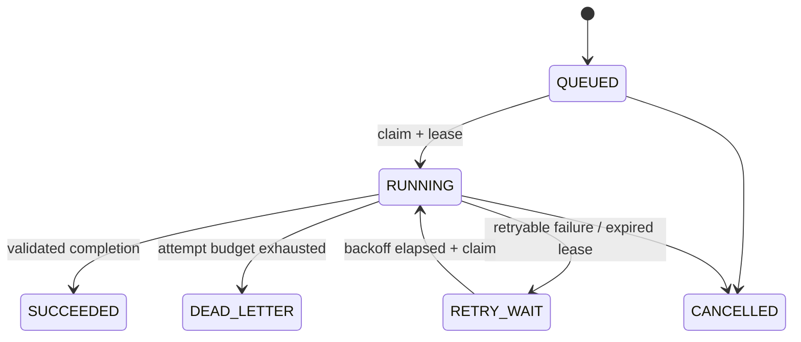

# ADR-002: Durable leased job queue

- Status: Accepted
- Date: 2026-09-02

## Context

The legacy control plane used `@Async`, manually created Java threads, and one `Thread.sleep` timeout thread per calculation. The Python API then created additional processes and posted results through callbacks. A Java or Python restart could lose in-flight work, and horizontal workers had no ownership protocol.

## Decision

Use MySQL 8 as the first durable queue because it already owns legacy task state and supports `SELECT ... FOR UPDATE SKIP LOCKED`.

1. Submission writes the legacy `ctask` row and `packing_job` row in one transaction.
2. Workers claim by capability and receive a time-limited UUID lease.
3. Claiming uses row locks with `SKIP LOCKED`, allowing multiple workers to claim concurrently without a global lock.
4. Workers heartbeat while the solver runs in an isolated child process.
5. Expired leases enter exponential-backoff retry or `DEAD_LETTER` after the attempt budget.
6. Completion requires the current lease and is idempotent after success.
7. Result persistence and legacy task-state updates happen before the job is committed as `SUCCEEDED`.

## Invariants

- `idempotency_key` permits one logical job per legacy task and stage.
- Only the current unexpired `lease_token` may heartbeat, fail, or complete a running job.
- Every claim increments `attempt`.
- Terminal states have no outgoing transition.
- Worker credentials are isolated from user JWTs through `X-Worker-Token`.

## Consequences

- Restarted workers resume queued work instead of losing it.
- Throughput scales with `WORKER_CONCURRENCY` and worker replica count.

## Claim lock ordering

Lease reaping runs in its own scheduled transaction rather than inside every
claim transaction. The claim query follows the composite claim index order
(`status`, `available_at`, descending `priority`, `created_at`, `id`) so MySQL
can stop after locking one eligible row instead of filesorting and locking a
large candidate set. This separation prevents the claim/update lock-order
cycle observed under concurrent Worker polling.
- Long calculations no longer occupy request or timeout threads in the Java process.
- MySQL is an intentional M1 dependency; queue pressure will be measured before introducing a separate broker or workflow engine.
